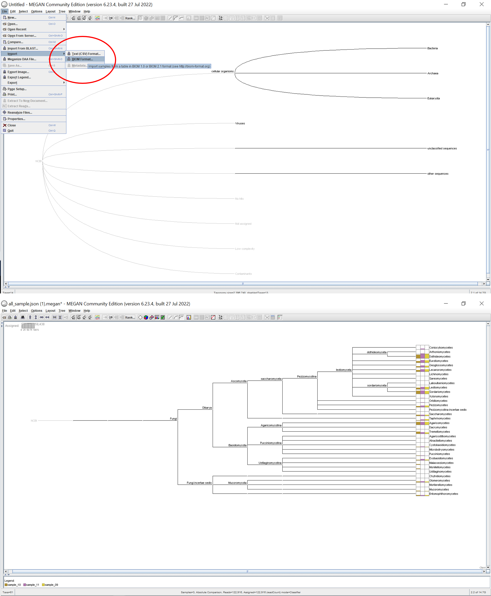

# sibero_its_nanopore
Full length ITS analysis from Nanopore

## Quick Start
### Clone and Install Dependencies
```bash
git clone git@github.com:matinnuhamunada/sibero_its_nanopore.git
cd sibero_its_nanopore
mamba env create -f env.yml
conda activate sibero
```

### Copy and extract NGS report
Copy the whole report file `GMS-2405-ITS.zip` to `data` folder and extract so that you have this folder structure:
```
data/
└── GMS-2405-ITS
    ├── Analysis
    │   ├── barcode09
    │   ├── barcode10
    │   ├── barcode11
    │   └── diversity_analysis
    ├── Centrifuge Report - Karimunjawa.pdf
    ├── Centrifuge Report - Mangkang.pdf
    ├── Centrifuge Report - Teluk Awur.pdf
    ├── Raw
    │   ├── barcode09.fastq.gz
    │   ├── barcode10.fastq.gz
    │   ├── barcode11.fastq.gz
    │   └── filtered
    └── Report
        ├── css
        ├── data
        ├── images
        ├── js
        └── report.html
```
### Convert Kraken result to BIOM format
Run Jupyter Notebooks via:
```bash
jupyter lab
```
Open the designated port (for example: http://localhost:8888/lab).
Open and run [notebooks/01_kraken_to_biom.ipynb](notebooks/01_kraken_to_biom.ipynb)

When you have run all cells, you should get this outputs:
```
output/
├── all_sample.json.biom
├── sample_09.hdf5.biom
├── sample_09.json.biom
├── sample_10.hdf5.biom
├── sample_10.json.biom
├── sample_11.hdf5.biom
└── sample_11.json.biom
```

### Use MEGAN6 to Interact with the Data
Donwload and install [MEGAN6](https://uni-tuebingen.de/fakultaeten/mathematisch-naturwissenschaftliche-fakultaet/fachbereiche/informatik/lehrstuehle/algorithms-in-bioinformatics/software/megan6/#:~:text=MEGAN6%20is%20a%20comprehensive%20toolbox,InterPro2GO%2C%20SEED%2C%20eggNOG%20or%20KEGG).
Import `all_sample.json.biom` to MEGAN.

